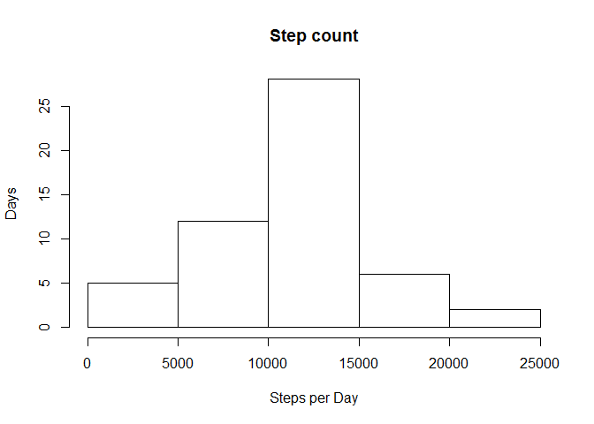
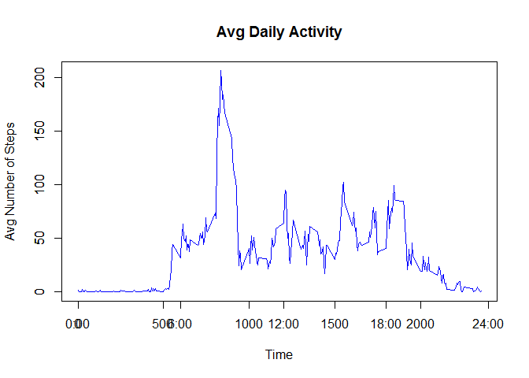
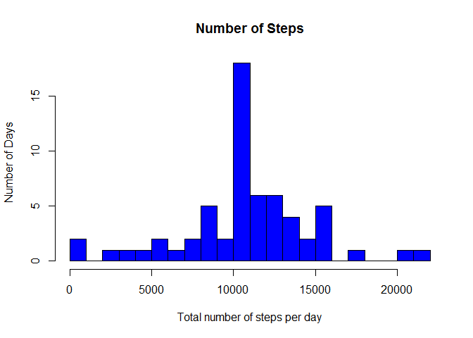

# Reproducible Research: Peer Assessment 1

## Loading and preprocessing the data


```r
data <- read.csv("data/activity.csv", header = T)

# create clean data
dataClean <- subset(data, is.na(data$steps) == F)
```

## What is mean total number of steps taken per day?

### 1. Make a histogram of the total number of steps taken each day

Find total steps per day


```r
library(plyr)
```

```
## Warning: package 'plyr' was built under R version 3.2.3
```

```r
totalPerDay <- ddply(dataClean, .(date), summarise, steps = sum(steps))
```

Construct histogram:


```r
hist(totalPerDay$steps, main = "Step count", xlab = "Steps per Day",
    ylab = "Days")
```



### 2. Calculate and report the mean and median total number of steps taken per day

Mean steps throughout the experiment:


```r
mean(totalPerDay$steps)
```

```
## [1] 10766.19
```


Median steps throughout the experiment:


```r
median(totalPerDay$steps)
```

```
## [1] 10765
```


## What is the average daily activity pattern?

### 1. Make a time series plot (i.e. type = "l") of the 5-minute interval (x-axis) and the average number of steps taken, averaged across all days (y-axis)

Linear plot showing the daily number of steps.


```r
averagePerInterval <- ddply(dataClean, .(interval), summarise, steps = mean(steps))
```


Plotting linear chart:


```r
plot(averagePerInterval$interval, averagePerInterval$steps, type = "l",
    col = "blue", xlab = "Time", ylab = "Avg Number of Steps", main = "Avg Daily Activity")
axis(1, at = c(0, 600, 1200, 1800, 2400), label = c("0:00", "6:00", "12:00",
    "18:00", "24:00"))
axis(2)
```




### 2. Which 5-minute interval, on average across all the days in the dataset, contains the maximum number of steps?


```r
averagePerInterval[which.max(averagePerInterval$steps), ]
```

```
##     interval    steps
## 104      835 206.1698
```

So it is the interval from 8:35 to 8:40

## Imputing missing values

### 1. Calculate and report the total number of missing values in the dataset (i.e. the total number of rows with NAs)


```r
sum(is.na(data$steps))
```

```
## [1] 2304
```


### 2.Devise a strategy for filling in all of the missing values in the dataset. The strategy does not need to be sophisticated.

Filling the NA cells with imputed data.

### 3. Create a new dataset that is equal to the original dataset but with the missing data filled in.


```r
imputed <- data

for (i in 1:nrow(imputed)) {
    if (is.na(imputed$steps[i])) {
        imputed$steps[i] <- averagePerInterval$steps[which(imputed$interval[i] ==
            averagePerInterval$interval)]
    }
}

imputed <- arrange(imputed, interval)
```


### 3. Make a histogram of the total number of steps taken each day and Calculate and report the mean and median total number of steps taken per day. Do these values differ from the estimates from the first part of the assignment? What is the impact of imputing missing data on the estimates of the total daily number of steps?

Total number of steps taken each day:


```r
totalPerDayImputed <- ddply(imputed, .(date), summarise, steps = sum(steps))
```


Plotting results:


```r
hist(totalPerDayImputed$steps, breaks = 20, main = "Number of Steps", xlab = "Total number of steps per day",
    ylab = "Number of Days", col = "blue")
```



Computing the mean and median of imputed data set:
Mean:


```r
mean(totalPerDayImputed$steps)
```

```
## [1] 10766.19
```

Median:

```r
median(totalPerDayImputed$steps)
```

```
## [1] 10766.19
```


Find the difference between the mean and median of clean and imputed datasets.


```r
abs(mean(totalPerDay$steps) - mean(totalPerDayImputed$steps))
```

```
## [1] 0
```


```r
abs(median(totalPerDay$steps) - median(totalPerDayImputed$steps))/median(totalPerDay$steps)
```

```
## [1] 0.0001104207
```


Although there is no difference in means, medians have change by 0.1%.


```r
totalDifference <- sum(imputed$steps) - sum(dataClean$steps)
totalDifference
```

```
## [1] 86129.51
```


Impute the dataset cause the estimation on total steps per day to increase

## Are there differences in activity patterns between weekdays and weekends?

### 1. Create a new factor variable in the dataset with two levels -- "weekday" and "weekend" indicating whether a given date is a weekday or weekend day.


```r
imputed$weekdays <- weekdays(as.Date(imputed$date))
imputed$weekdays <- ifelse(imputed$weekdays %in% c("Saturday", "Sunday"), "weekend",
    "weekday")
```


### 2.Make a panel plot containing a time series plot (i.e. type = "l") of the 5-minute interval (x-axis) and the average number of steps taken, averaged across all weekday days or weekend days (y-axis).

Calculating the avergage steps for weekday and weekends.


```r
average <- ddply(imputed, .(interval, weekdays), summarise, steps = mean(steps))
```


Plotting results:

```r
library(lattice)
xyplot(steps ~ interval | weekdays, data = average, layout = c(1, 2), type = "l",
    xlab = "Interval", ylab = "Number of steps")
```


